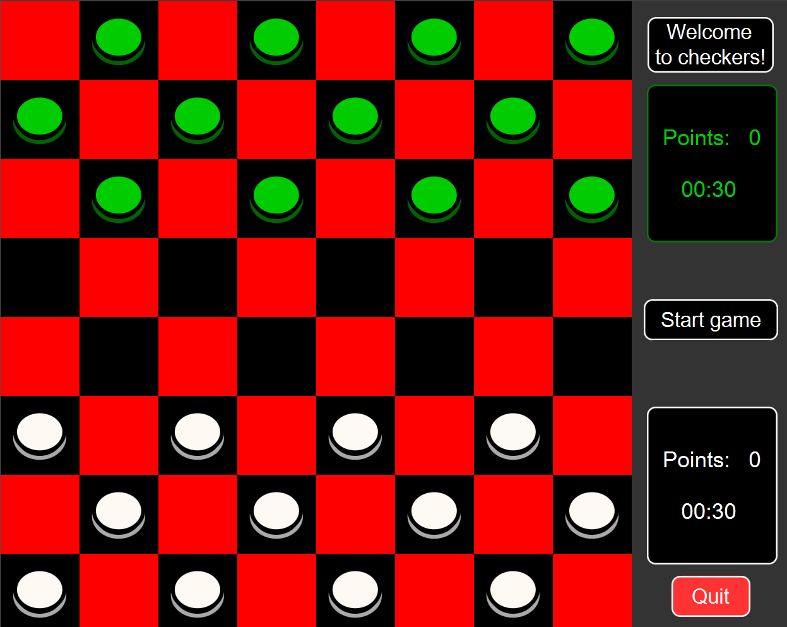
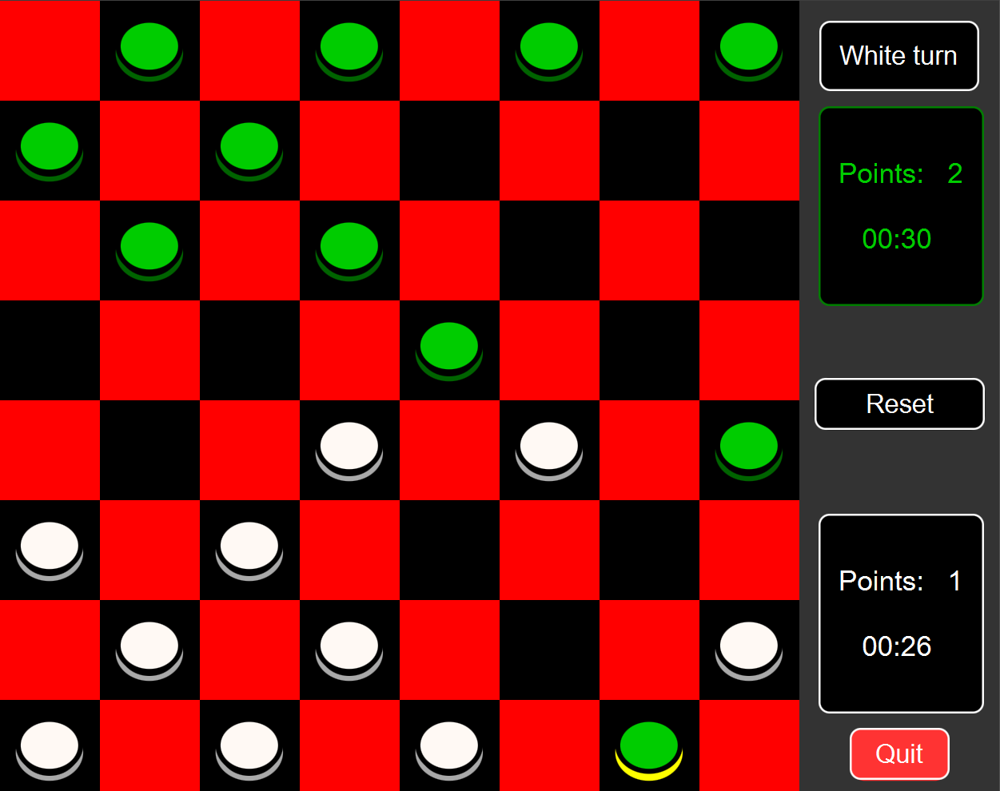

# **CheckersJavaFX** 

# **About the project**
It's an university project allowing 2 players to play a game of checkers on one device.  
Features timers and kinged pieces. Written in JavaFX.

# **How to play**
- Press the start button on the right
- Players can move their pieces by dragging them onto desired tile
- Each player has 30 seconds to make a move.
- If the player manages to travel the whole board their piece becomes a king
- King pieces can move 1 tile in both directions
- Player who kills all enemy pieces wins

# **GUI PRESENTATION**

